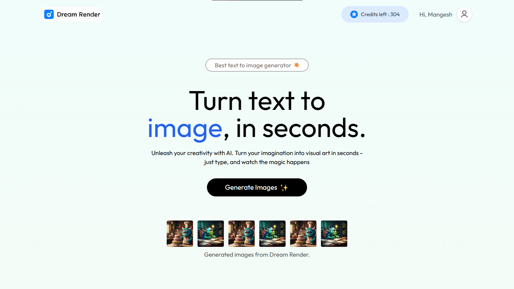
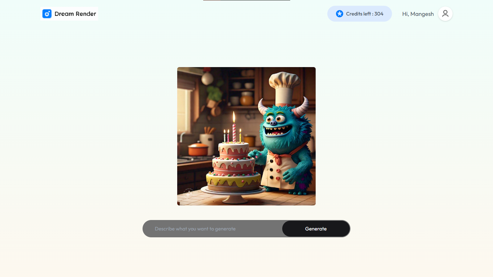

# Dream Render

Dream Render is a SaaS platform that generates AI-powered images from text prompts, leveraging an external API for image generation. Users can create unique, high-quality images simply by entering their desired text, with an intuitive interface for seamless interaction.

## Features

- **Text-to-Image Generation**: Generate high-quality images from text prompts using AI-powered image generation.
- **Subscription Model**: Implemented a robust subscription model with secure payment processing via Razorpay.
- **Download Image**: View and download your generated images.
- **Authentication**: Secure sign-up and sign-in for saving your image generation history and subscription details.
- **Responsive UI**: A modern, user-friendly interface that is optimized for various devices.

## Technologies Used

- **React**: Frontend library for building the user interface.
- **TypeScript**: Strongly-typed JavaScript for better code quality and maintainability.
- **Express**: Backend framework for handling API requests and business logic.
- **MongoDB**: Database for storing user accounts, prompts, image generation history, and subscription data.
- **Razorpay**: Payment gateway for securely processing subscriptions and handling payments.
- **External Image Generation API**: Powered by an external API for scalable image generation.
- **Tailwind**: CSS library for creating a responsive and stylish interface.
- **Vercel**: Platform for deploying and hosting the web application.

## Screenshots

*Home Page with Text-to-Image Prompt*

*Generated Image Preview*

## Usage

1. **Sign Up**: Create an account to start generating images and saving them in your gallery.
2. **Generate Images**: Enter a text prompt to generate an image instantly.
3. **Subscription**: Subscribe to the service using Razorpay for seamless payment processing.
5. **Download Images**: Save your generated images to your local device.

## Deployment

The project is deployed on Vercel. You can view the live application [here](https://dream-render.vercel.app/).

## Contributing

Contributions are welcome! Please fork the repository and create a pull request with your changes.

## Contact

For any inquiries, please reach out to [email](mailto:mangeshraje55555@gmail.com).
